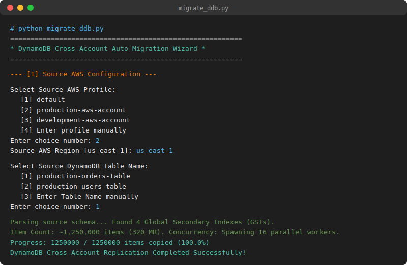

# aws-dynamodb-migrator



A standalone, production-grade Python CLI tool to migrate AWS DynamoDB tables and replicate their data across different AWS accounts (cross-organization) or within the same AWS account (for cross-region migration or table cloning).

This tool **handles everything automatically**: it reads the source table's configurations (AttributeDefinitions, KeySchema, Global Secondary Indexes (GSIs), capacity BillingMode, and stream specifications) and recreates the target table in the destination account. It then scans and copies **100% of the data records** programmatically.

**No manual pre-creation or configuration is required in the destination account.**

---

## Supported Use Cases

This utility is highly versatile and supports three main migration scenarios:

1. **Cross-Account Migration (Cross-Organization):** Replicate tables and migrate data from a legacy AWS account to a new organization account (using different source and target AWS profiles).
2. **Cross-Region Migration (Same AWS Account):** Copy tables and migrate data from one region to another (e.g. `us-east-1` to `us-west-2`) within the same AWS account (using the same profile for source and target).
3. **Table Cloning & Renaming (Same Region):** Instantly clone a table and its entire dataset to a new name (e.g. `my-table` to `my-table-backup` or `my-table-v2`) within the same account and region, preserving all configurations.

---

## Key Features

* **Zero Pre-Setup Required:** Recreates the exact table schema (including partition/sort keys, GSIs, streams, and capacity modes) in the target account automatically before migrating data.
* **Auto-Optimizing Concurrency Engine:**
  - Automatically reads the source table size and item count to calculate the optimal number of parallel migration threads (spawns up to 16 concurrent workers).
  - Automatically reads the target table's **Write Capacity Units (WCUs)**. If target capacity is low (e.g. provisioned with 1-10 WCUs), it limits the workers to prevent AWS write throttling. If it is On-Demand, it runs at maximum parallel speed.
* **Segmented Parallel Scanning:** Leverages DynamoDB's native parallel segmented scans, querying and writing partitions concurrently across threads for up to **10x faster migration speeds** over the network.
* **Resumable Migration Checkpoints:** Keeps track of segment-level progress checkpoints locally. If the execution is interrupted (due to a network loss, etc.), re-running the script will detect the checkpoint and resume scanning exactly where it left off, avoiding redundant writes and costs.
* **Memory Safe:** Streams table items using paginated scans in 1 MB chunks. Never loads the entire dataset into memory.

---

## How it Handles Large Datasets (1 Million+ Records)

When migrating very large tables, the script employs three mechanisms to keep the replication fast and cost-effective:

1. **Concurrency Control:** Spawns multiple threads that run Segmented Scans in parallel. While Segment 1 reads the first partition, Segment 2 concurrently reads the second partition, etc., multiplying network throughput.
2. **Exponential Backoff and Retries:** Utilizes Boto3's native `batch_writer` which automatically batches items in groups of 25 and handles retrying `UnprocessedItems` if write requests are throttled.
3. **Progress State Checkpoint:** Saves segment scan pointers to a local `.ddb_migration_checkpoint.json` file. If the transfer is interrupted, it resumes scanning from the checkpoint key. The file is deleted automatically upon a successful transfer.

---

## Setup & Requirements

1. Make sure **Python 3** is installed:
   ```bash
   python --version
   ```

2. Install the AWS SDK dependency:
   ```bash
   pip install -r requirements.txt
   ```

3. **AWS Authentication Setup:**
   The tool automatically reads profiles configured in your local AWS shared credentials file. Make sure your profiles are defined in the credentials file.
   
   * **File Location:**
     * **Windows:** `C:\Users\<YourUsername>\.aws\credentials` (or `%USERPROFILE%\.aws\credentials`)
     * **macOS/Linux:** `~/.aws/credentials`
     
   * **Credentials Format Example:**
     Add your source and target profiles to the file:
     ```ini
     [source-profile-name]
     aws_access_key_id = YOUR_ACCESS_KEY_ID
     aws_secret_access_key = YOUR_SECRET_ACCESS_KEY
     # Include session token if using temporary credentials
     aws_session_token = YOUR_SESSION_TOKEN
     
     [target-profile-name]
     aws_access_key_id = YOUR_TARGET_ACCESS_KEY_ID
     aws_secret_access_key = YOUR_TARGET_SECRET_ACCESS_KEY
     aws_session_token = YOUR_TARGET_SESSION_TOKEN
     ```

---

## Running the Migration

The tool supports two execution modes: **Interactive Wizard** and **Automated Command Line**.

### Mode A: Interactive Wizard (Default)
Simply run the script with no arguments:
```bash
python migrate_ddb.py
```
1. **Source Profile:** Select the profile with access to the source table.
2. **Source Region:** Select region (defaults to `us-east-1`).
3. **Source Table Name:** Select your table.
4. **Target Settings:** Select target AWS profile, region, and table action (recreate or write into existing).
5. **Confirmation:** Displays the final migration summary and runs the auto-optimized migration.

---

### Mode B: Automated CLI (For CI/CD & Automation)
To automate execution, pass the configuration arguments directly:

```bash
# Replicate a table (Cross-Account)
python migrate_ddb.py \
  --src-profile John-Hernandez \
  --src-table stg_menu_builder \
  --tgt-profile MenuBuilder-Dev \
  --yes

# Clone a table (Same Account & Region)
python migrate_ddb.py \
  --src-profile MenuBuilder-Dev \
  --src-table my-table \
  --tgt-profile MenuBuilder-Dev \
  --tgt-table my-table-backup \
  --yes
```

#### Available CLI Arguments:
* `--src-profile`: Source AWS CLI profile name (Required for automated mode)
* `--src-table`: Source DynamoDB Table Name (Required for automated mode)
* `--tgt-profile`: Target AWS CLI profile name (Required for automated mode)
* `--src-region`: Region for source table (Default: `us-east-1`)
* `--tgt-region`: Region for target table (Default: `us-east-1`)
* `--tgt-table`: Name of target table (Default: same as source name)
* `--yes`: Bypasses the final confirmation summary block and executes immediately
* `--verbose`: Enables debug-level logging outputs in the console
